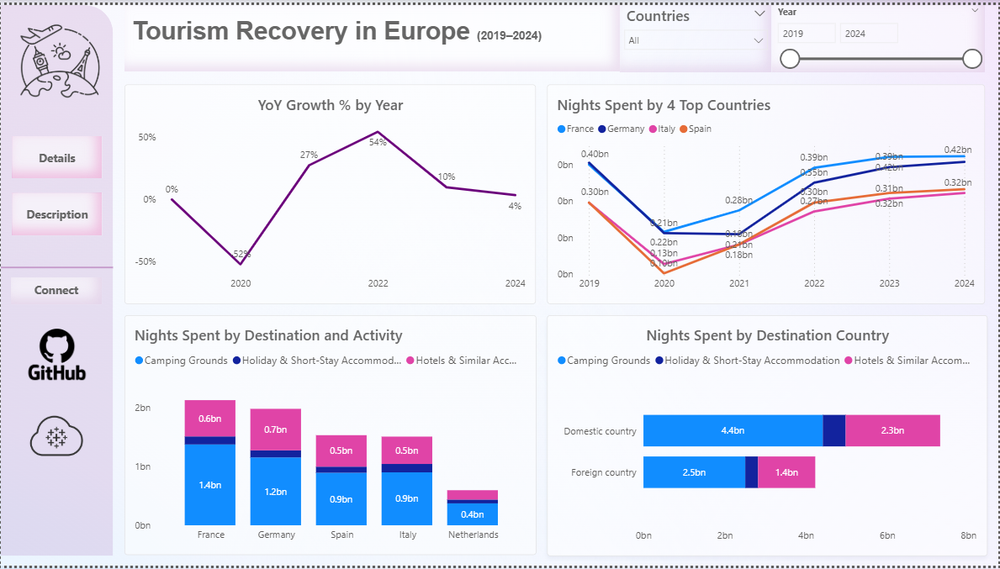

# 🏨 Tourism Accommodation Analysis (2019–2024)

This project explores the recovery of tourism across European countries from 2019 to 2024, with a focus on accommodation trends and traveler behavior. Using real-world data, I built an interactive Power BI dashboard to visualize key metrics such as nights spent, year-over-year growth, and country-level comparisons.

## 📊 Dashboard Highlights
- **YoY Growth % by Year**: Tracks the impact of the pandemic and recovery trends from 2020 to 2024.
- **Top 5 Countries by Nights Spent**: Line chart comparing France, Germany, Italy, Spain, and the Netherlands.
- **Accommodation Type Breakdown**: Bar chart showing preferences across hotels, short-stay rentals, and camping grounds.
- **Total Nights by Destination**: Horizontal bar chart ranking countries by total nights spent.

## 🎯 Objectives
- Analyze how tourism rebounded post-COVID across major European destinations.
- Identify which countries and accommodation types saw the fastest recovery.
- Practice storytelling through data visualization using Power BI.

## 🛠️ Tools & Skills Used
- **Power BI**: Data modeling, filtering (Top N), custom visuals, formatting
- **Data Cleaning**: Manual adjustments for consistency and readability
- **Visualization Design**: Clear layout, color-coded legends, and intuitive chart types

## 📌 Key Insights
- France and Germany lead in total nights spent, each reaching 1.5 billion.
- 2020 marked the lowest point, with a 50% drop in YoY growth.
- Hotels and short-stay accommodations dominate traveler preferences.
- Recovery began in 2021, peaking in 2022 with a 50% growth rate.

## 🧠 What I Learned
- How to use Power BI’s **Top N filter** to focus visuals without DAX
- The importance of chart formatting for storytelling
- How to structure dashboards for professional presentations

